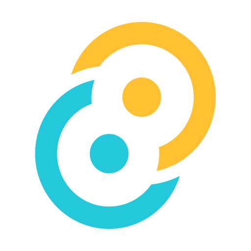

# Sable

**Premium Windows Gaming Optimizer & Performance Overlay**

 

[**⬇ Download for Windows**](https://github.com/joshsegatt/Sable-Overlay-Gamer/releases/latest)

 

---

## What is Sable?

Sable is a lightweight, high-performance desktop app built for gamers who care about every frame. It runs silently in the background, collects real-time telemetry from your GPU and CPU, applies per-game optimizations, and surfaces everything through a clean overlay — without the bloat.

No subscriptions. No telemetry farms. Just your PC, running at its best.

---

## Features

### Real-Time Performance Overlay
See your FPS, frametime, GPU usage, CPU load, and VRAM consumption in-game — always updated, never intrusive. Fully customizable position and opacity.

### Per-Game Optimization Profiles
Sable automatically detects the game you're running and applies the right settings profile the moment it launches. Tweak once, forget forever.

### Benchmark Recording
Record full frametime sessions, compare results side-by-side, and track how your rig performs across patches and driver updates. Export to CSV or review inside the app.

### System Intelligence
Get a full read on your hardware — thermals, memory pressure, pipeline bottlenecks — in a single panel. Sable surfaces what matters, cuts the noise.

### One-Click Optimizer
Apply curated presets that tune Windows for gaming: latency, scheduler priority, power plan, and GPU driver settings — all reversible, all explained.

### Bottleneck Report
Sable analyzes your hardware balance and tells you exactly where your system is being held back — and what to do about it.

---

## Installation

1. Go to the [**Releases**](https://github.com/joshsegatt/Sable-Overlay-Gamer/releases/latest) page
2. Download `Sable_x64-setup.exe` (NSIS installer) or `Sable_x64_en-US.msi`
3. Run the installer — no admin prompt, no bloatware
4. Launch Sable and follow the 2-minute setup

Sable updates itself automatically when a new version is available.

---

## System Requirements

| | Minimum |
|---|---|
| **OS** | Windows 10 64-bit (build 1903+) |
| **GPU** | DirectX 11 compatible |
| **RAM** | 4 GB |
| **Storage** | 150 MB |

> Windows 11 recommended for best experience.

---

## Privacy

Sable only collects anonymous performance metrics to improve optimization presets — and only with your explicit consent during setup. You can revoke consent at any time from **Settings → Privacy**. No data is ever sold or shared.

---

Built with [Tauri](https://tauri.app) · Rust · React

